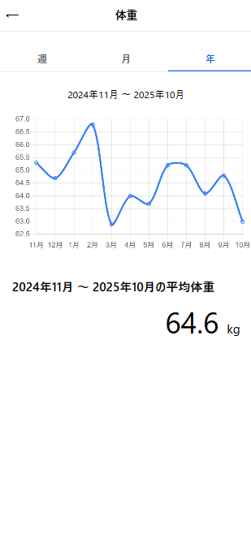
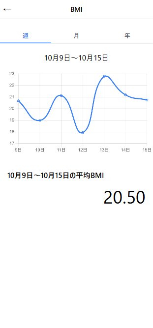

# WeightManagement（体重管理システム）

URL: https://weightmanagement.sakuraweb.com/login 

テストユーザー 
メール: test@example.com 
パスワード: password 

開発・確認用のサンプルユーザーです。 

## 📘 概要
ユーザーが日々の体重や生活習慣を簡単に記録し、健康的な体重管理を行えるアプリケーション。 
体重・体脂肪率・睡眠などを一元管理し、グラフや比較でモチベーション維持をサポートします。

---

## 開発背景
自分自身の体重管理や生活習慣の把握を簡単に行いたいと考えたことが開発のきっかけです。 
Laravelを使い、フォーム入力 → データ登録 → グラフ・統計表示までの一連のWebアプリケーションを実装し、学習と実務的な開発経験を兼ねて開発しました。

---

## 技術スタック

**バックエンド** | PHP 8.4 / Laravel 12 
**フロントエンド** | Blade / Tailwind CSS / JavaScript / Chart.js 
**データベース** | MySQL 8 
**環境構築** | Docker 
**テスト** | PHPUnit 
**メール機能**  Mailpit 
**認証** | Laravel Breeze

---

## 主な機能
### ユーザー用データ入力
- 日々の体重入力（必須）
- 睡眠時間（時間＋分）
- 食事記録（選択肢・自由記入・写真最大5枚）
- 運動内容（選択肢・自由記入）

### 自動計算
- BMI・標準体重・体脂肪率（推定式）・睡眠時間の自動計算

### グラフ表示
- 週/月/年ごとの平均体重・体脂肪率・BMI・睡眠時間のグラフ表示

### 認証機能
- ユーザー登録／ログイン／ログアウト
- プロフィール管理（名前・メールアドレス・性別・生年月日・身長・目標体重）

---

## 画面イメージ

## データ入力画面

<table>
<tr>
  <td valign="top">
    ホーム 
     
  </td>
  <td valign="top">
    記録 
     
  </td>
  <td valign="top">
    マイページ 
    
  </td>
</tr>
<tr>
  <td valign="top">
    記録一覧 
    
  <td valign="top">
    記録詳細 
    
  </td>
</tr>
</table>

## グラフ表示

<table>
<tr>
  <td valign="top">
    【週】体重 
     
  </td>

  <td valign="top">
    【月】体重 
     
  </td>

  <td valign="top">
    【年】体重 
     
  </td>
</tr>
</table>

<table>
<tr>
  <td valign="top">
    【週】BMI 
     
  </td>

  <td valign="top">
    【月】BMI 
     
  </td>

  <td valign="top">
    【年】BMI 
     
  </td>
</tr>
</table>

<table>
<tr>
  <td valign="top">
    【週】体脂肪率 
     
  </td>

  <td valign="top">
    【月】体脂肪率 
     
  </td>

  <td valign="top">
    【年】体脂肪率 
     
  </td>
</tr>
</table>

<table>
<tr>
  <td valign="top">
    【週】睡眠時間 
     
  </td>

  <td valign="top">
    【月】睡眠時間 
     
  </td>

  <td valign="top">
    【年】睡眠時間 
     
  </td>
</tr>
</table>
